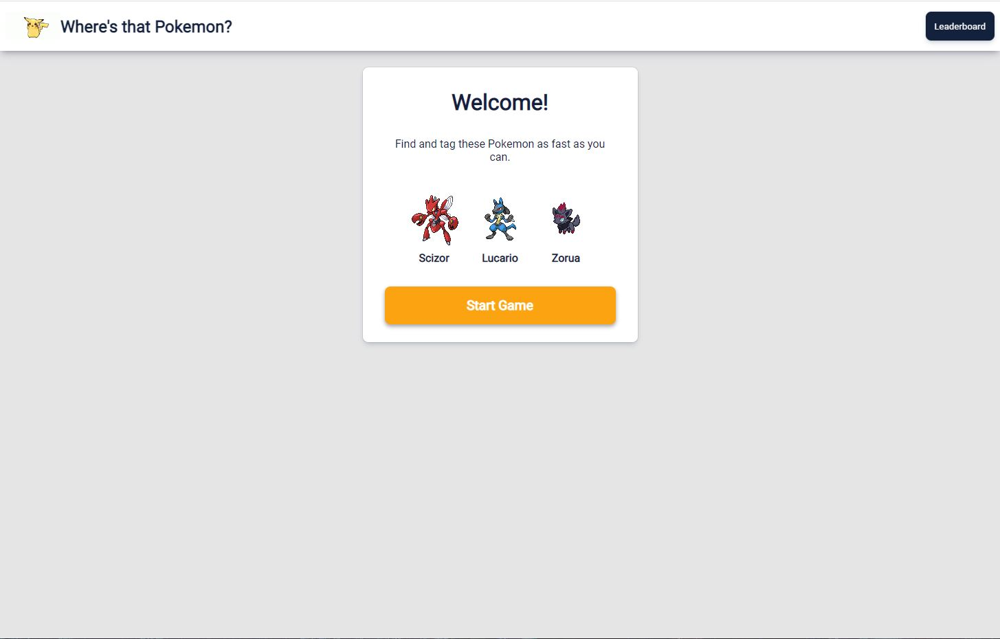
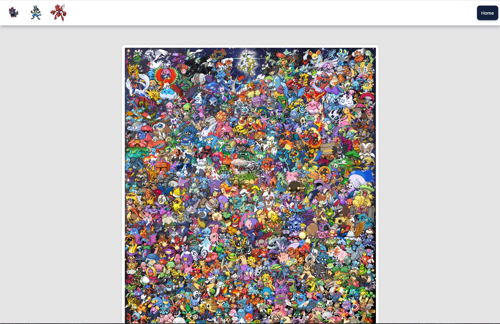
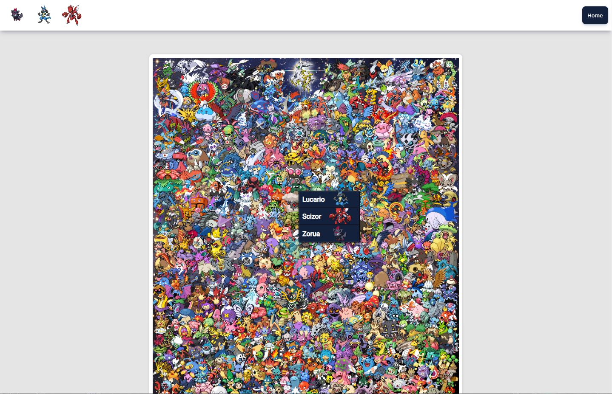
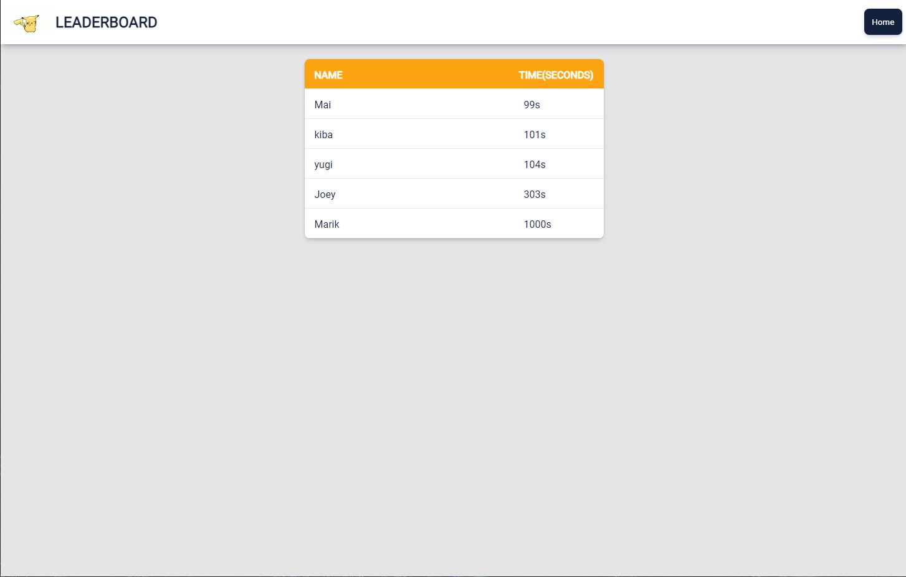

# TheOdinProject - Project: Where's Waldo Solution

This is a solution to the [Project: Where's Waldo (A Photo Tagging App)](https://www.theodinproject.com/lessons/node-path-javascript-where-s-waldo-a-photo-tagging-app). 

## Table of contents

- [Overview](#overview)
  - [The challenge](#the-challenge)
  - [Screenshot](#screenshot)
  - [Links](#links)
- [My process](#my-process)
  - [Built with](#built-with)
  - [What I learned](#what-i-learned)
  - [Continued development](#continued-development)
  - [Useful resources](#useful-resources)
- [Author](#author)


## Overview

### The challenge

Users should be able to:

- Build an app that feels a whole lot like a photo tagging app
- When user clicks on an area of the photo, let it display a character selection box
- Use backend to check for character location
- Track users when photo loads and when selecting all characters to calculate score from the backend


### Screenshot







### Links

- Solution URL: [https://github.com/Kevo760/WheresThatPokemon-TheOdinProject]
- Live Site URL: [https://Kevo760.github.io/WheresThatPokemon-TheOdinProject/#/]

## My process

### Built with

- Semantic HTML5 markup
- CSS custom properties
- Flexbox
- CSS Grid
- [React](https://reactjs.org/) - JS library
- [Firebase](https://firebase.google.com/) - Backend server
- [Styled Components](https://styled-components.com/) - For styles


### What I learned

At first trying to figure out how firebase worked was very frustrating. It was hard to get, but after doing a few test and examples I was able to understand how to get data and send data through firebase. The getServerScores was a tough one to figure out especially I did not know how to put multiple data inside a variable from a firebsae collection. I found out you had to use the forEach then push that data to an array variable then set the state to it after. I also had a hard time in the beggining on figuring out how to get a position value of an area that a user clicks. There was a few methods to get the position value, but most of them did not give the same value when the window is resized. I found that the event.nativeEvent.offset worked no matter if the window is resized. 


```js
const getServerScores = async() => {
            const scoreRef = collection(db, 'Scores')
            const scoreDoc = await getDocs(scoreRef)
            const data = []
            scoreDoc.forEach((doc) => {
                data.push({...doc.data()})
            })
            setpScore(data)
            // sort score by lowest value
        const sortScore = pScore.sort(({score:a}, {score:b}) => a-b)
        // setScore using scoreboxsections
        const scores = sortScore.map(player => <ScoreBoxSections key={player.id}><p>{player.name}</p><p>{player.score}s</p></ScoreBoxSections>)
        setShowScore(scores)
        setIsLoading(false)
        }

const selectionHandler = (e) => {
    showSelectionToggle();
    const positionChange = {
      x: e.nativeEvent.offsetX,
      y: e.nativeEvent.offsetY
    }
    setSelectPosition(positionChange)
  }

```


### Continued development

I would like to continue on learning on backend with other websites. I like the backend due to being able to store data that you do not want to user to see or get.
I am making progress where I can easily remember how to create functions, but sometimes do need to look up things in detail. I would also like to do more Test Driven Development, So far I do testing, but function testing on console.log or creating test functions then later changing them to real functions inside the projects.  


### Useful resources

- [Stackoverflow](https://www.stackoverflow.com) - This helped me searched for certain functions that I had forgotten and needed more information on. 
- [Firebase](https://firebase.google.com/docs/firestore) - This is an amazing doc that allowed me to figure out the basics of firebase on how to add and remove data.


## Author

- Twitter - [@CoverKevo](https://www.twitter.com/CoderKevo)
- Email - [kevin760g@gmail.com]


